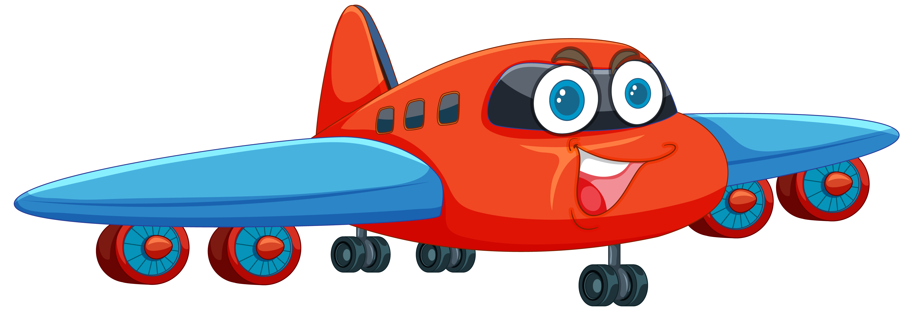
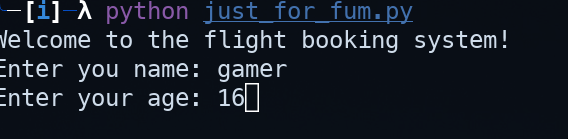
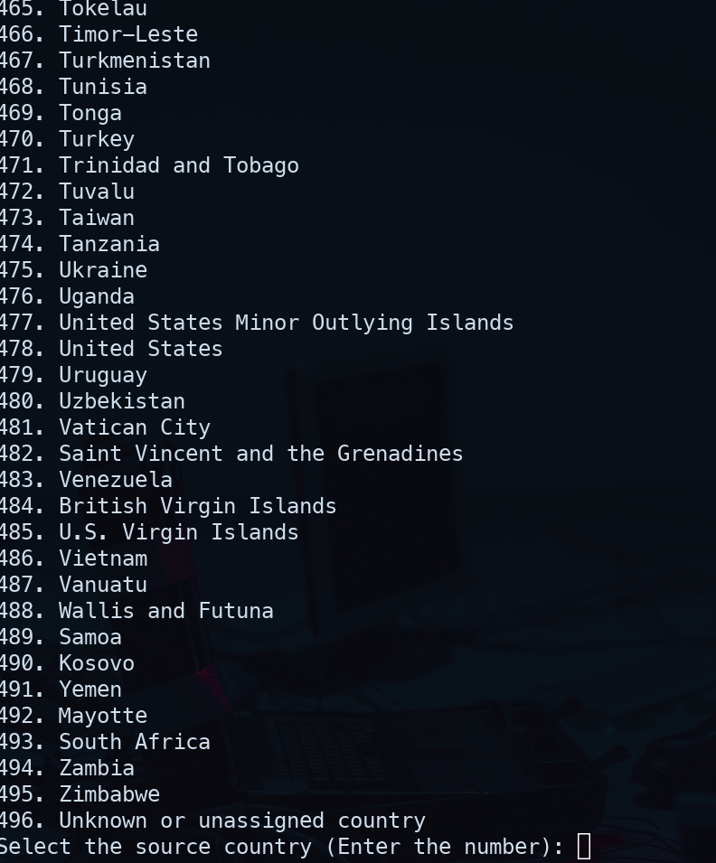
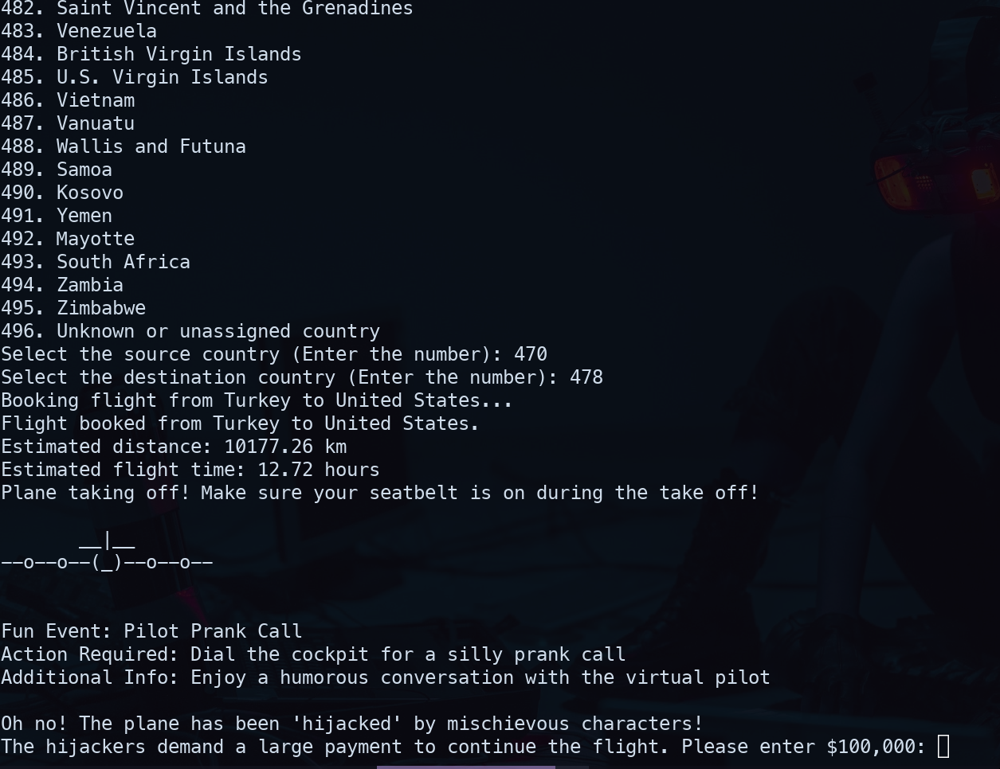

# Flight Simulator Game

## Overview

The Flight Simulator Game is a lighthearted and humorous text-based game that simulates a fun and entertaining flight experience. The game incorporates interactive elements, quirky events, and playful scenarios to engage players during the flight simulation.

## Features

- Book flights between different countries and experience unique destinations.
- Enjoy entertaining ASCII art animations during takeoff.
- Interact with humorous fun events triggered during the flight.
- Playfully navigate through unexpected challenges and scenarios, such as a mischievous "hijack" scenario.

## How to Play

1. Select the source and destination countries for your flight.
2. Experience amusing events and scenarios during the flight.
3. Engage with interactive elements, such as trivia questions and humorous challenges.
4. Navigate through the playful "hijack" scenario with the mischievous characters.

## How to Play

1. **Start the Game**: Run the `flight_simulator.py` script to begin your adventure.
2. **Create or Select a User**: Enter your name to create a new user or retrieve existing user details.
3. **Book a Flight**: Choose your source and destination countries. Select airports and confirm your flight booking.
4. **Experience Fun Events**: Engage with interactive and humorous events during your flight.
5. **Navigate Challenges**: Handle playful scenarios like the "hijack" event with mischievous characters.
6. **Check CO2 Consumption**: Monitor your CO2 consumption and earn funny titles based on your eco-friendliness.
7. **Enjoy the Journey**: Learn fun facts about your destination and enjoy the ASCII art animations.
8. **Play Again**: Decide if you want to book another flight or end your journey.

## Getting Started

1. Clone or download the game repository.
2. Ensure you have Python installed on your system.
3. Install the required dependencies, such as `mysql-connector-python` and `geopy`.
4. Ensure the `secrets.py` file contains the correct database connection details.
5. Set the OpenWeatherMap API key as an environment variable: `export OPENWEATHER_API_KEY=your_api_key`.
5. Run the game script (`flight_simulator.py`) to start the flight simulation.

## Fun and Entertainment Awaits

Embark on a delightful journey with the Flight Simulator Game and enjoy the whimsical and amusing experiences that await you during your virtual flight adventure.

Have a great flight and lots of laughter along the way!

## Screen Shots

### Asking player name and age

### Player books flight

### Running the game

q
